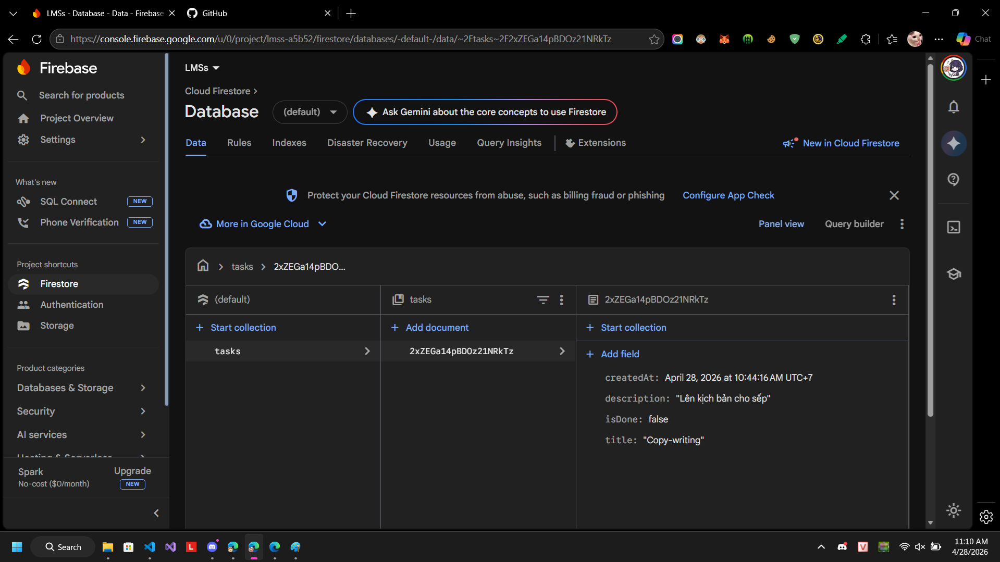
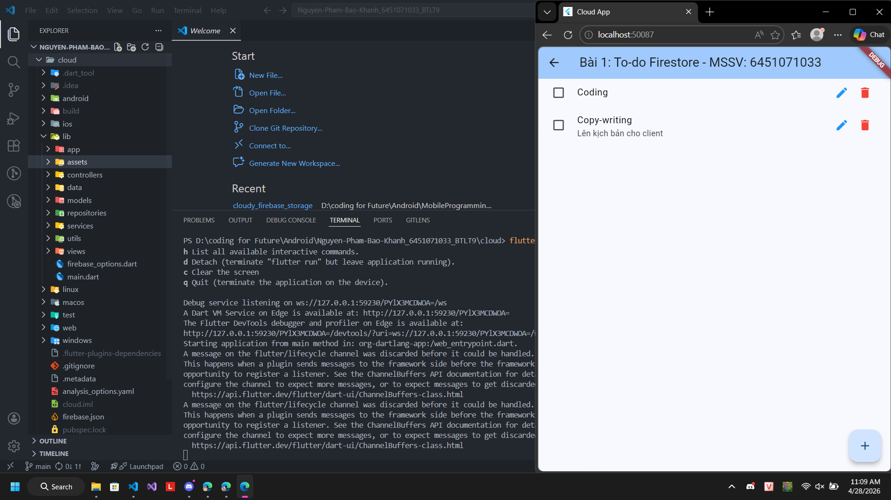
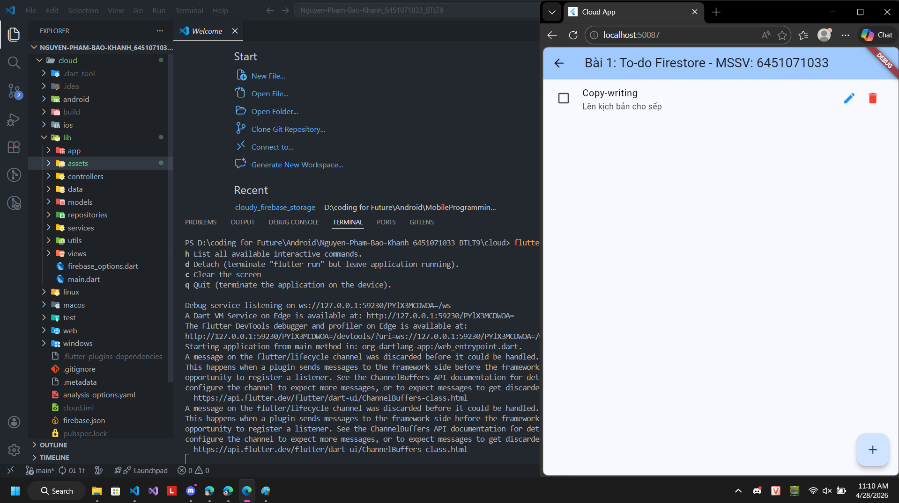
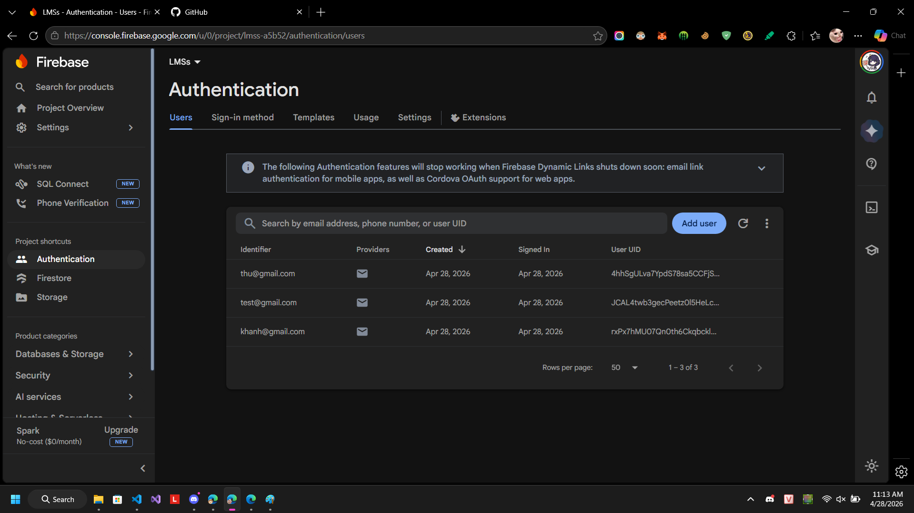
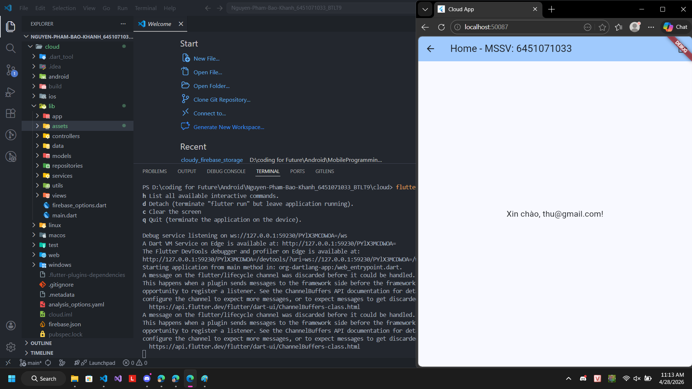
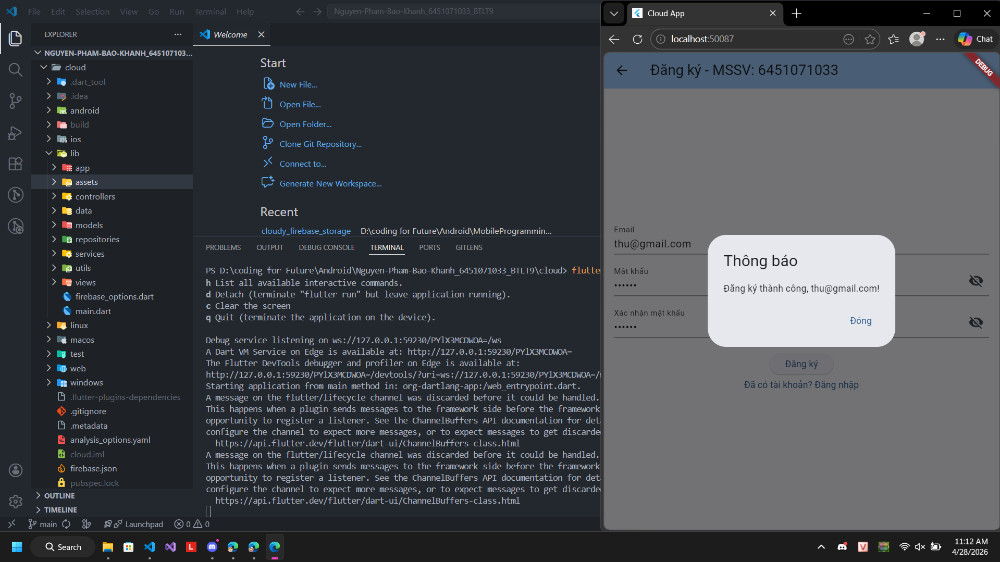

# Kết quả BTLT9

- **Họ và tên:** Nguyễn Phạm Bảo Khanh
- **MSSV:** 6451071033

## Bài 1: Quản lý Công việc (To-Do List)
*Kết nối Firebase Firestore*

### Kết quả Database Firestore

### Các tính năng
- [x] Chức năng thêm công việc mới.
  
- [x] Chức năng chỉnh sửa nội dung công việc.
  
- [x] Chức năng thay đổi trạng thái hoàn thành.
- [x] Chức năng xóa công việc.
  

## Bài 2: Xác thực Người dùng (Authentication)
*Tích hợp Firebase Authentication*

### Kết quả Firebase Authentication

### Các tính năng
- [x] Màn hình đăng ký tài khoản (Register).
  
- [x] Màn hình đăng nhập (Login) & Xử lý chuyển hướng đến trang chủ (Home) sau khi đăng nhập thành công.
  
